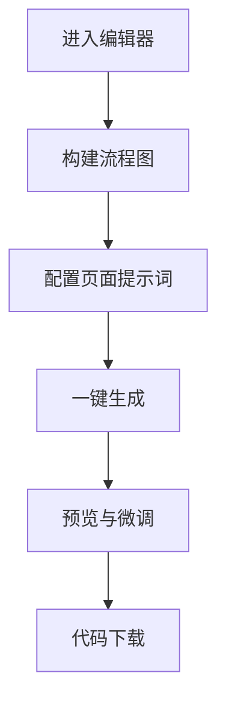

# 产品需求文档（PRD）：FlowForge v1.0

**文档状态**：MVP 定义版  
**产品负责人**：[你的姓名]  
**更新日期**：2026-04-15

---

## 1. 产品概述
FlowForge是一个通过流程图直接驱动可交互多页面应用一键生成的工具，将原型验证周期从天级缩短至分钟级。
- 核心目标是让产品逻辑可视化，让网页应用生成自动化，为产品经理和开发者提供高效的原型验证解决方案。
- 目标用户包括AI产品经理/效率工具产品经理、游戏系统策划以及独立开发者/创业者。

## 2. 核心功能

### 2.1 用户角色
| 角色 | 注册方式 | 核心权限 |
|------|---------------------|------------------|
| 普通用户 | 邮箱注册 | 使用流程图编辑器、生成应用、预览和下载代码 |

### 2.2 功能模块
1. **编辑器页面**：流程图编辑器、节点库、画布操作、导入导出功能
2. **配置页面**：页面提示词配置、全局样式设定、组件黑/白名单
3. **生成与预览页面**：AI生成代码、在线预览、代码下载

### 2.3 页面详情
| 页面名称 | 模块名称 | 功能描述 |
|-----------|-------------|---------------------|
| 编辑器页面 | 流程图编辑器 | 提供节点库（开始/结束、普通页面、条件分支页），支持拖拽连线，连线自动吸附，删除连线需二次确认 |
| 编辑器页面 | 画布操作 | 支持缩放、平移、撤销/重做 |
| 编辑器页面 | 导入导出 | 支持导出为 JSON 文件，支持导入 `.flowforge` 格式 |
| 配置页面 | 节点描述输入 | 每个节点支持 200 字以内的自然语言描述 |
| 配置页面 | 全局样式设定 | 设置全局主题色、字体、圆角风格（应用于所有生成页面） |
| 配置页面 | 组件黑/白名单 | 指定生成代码时禁止使用的复杂组件，以提升生成稳定性 |
| 生成与预览页面 | AI生成代码 | 蓝图解析器将流程图数据转为结构化JSON，并发请求AI生成各页面组件代码，自动生成React Router配置 |
| 生成与预览页面 | 在线预览 | 生成完成后，提供内嵌预览链接（类似CodeSandbox预览） |
| 生成与预览页面 | 代码下载 | 打包下载完整的React + Tailwind CSS项目源代码 |

## 3. 核心流程
用户使用FlowForge的核心流程为：进入编辑器 → 构建流程图 → 配置页面提示词 → 一键生成 → 预览与微调。

## 4. 用户界面设计
### 4.1 设计风格
- 主色调：蓝色系（#1E40AF）和白色（#FFFFFF）
- 辅助色：浅灰色（#F3F4F6）和深灰色（#374151）
- 按钮风格：圆角按钮，主按钮使用填充色，次要按钮使用描边
- 字体：无衬线字体，主标题18-24px，正文14-16px
- 布局风格：左侧工具栏，中央画布，右侧属性面板的三栏布局
- 图标风格：简洁的线性图标，使用Material Design风格

### 4.2 页面设计概览
| 页面名称 | 模块名称 | UI元素 |
|-----------|-------------|-------------|
| 编辑器页面 | 流程图编辑器 | 拖拽式节点库，画布网格背景，连线自动吸附效果，节点选中状态高亮 |
| 编辑器页面 | 画布操作 | 缩放控制按钮，平移工具，撤销/重做按钮组 |
| 配置页面 | 节点描述输入 | 文本输入框，字符计数，保存按钮 |
| 配置页面 | 全局样式设定 | 颜色选择器，字体下拉菜单，圆角滑块 |
| 生成与预览页面 | 在线预览 | 响应式预览窗，设备切换按钮（手机/PC），刷新按钮 |
| 生成与预览页面 | 代码下载 | 下载按钮，框架选择（React），打包选项 |

### 4.3 响应式设计
- 桌面优先设计，支持1200px以上屏幕
- 平板适配：1024px-1199px，调整布局为两栏
- 移动适配：768px以下，转为单栏布局，通过标签页切换不同功能区域
- 触摸优化：增大触摸目标，支持手势操作画布

### 4.4 3D场景指导（不适用）
本产品为2D流程图编辑器，不涉及3D场景。

---

## 5. 非功能性需求与技术约束

### 5.1 性能指标
- **流程图解析时间**：< 1s
- **首屏页面生成时间**：< 15s（并发生成，非串行）
- **生成成功率**：> 95%（单页面结构描述清晰前提下）

### 5.2 技术约束
- **AI模型**：优先使用Claude 4或GPT-5系列模型，确保前端代码生成质量
- **前端框架**：MVP阶段仅支持React + Tailwind CSS输出
- **流程图库**：基于开源项目React Flow进行二次开发

### 5.3 安全性
- 用户输入的页面描述需经过敏感词过滤
- 生成的代码在沙箱环境执行预览，防止XSS攻击

---

## 6. 成功指标

| 指标名称 | MVP目标值 | 衡量方式 |
| :--- | :--- | :--- |
| **流程图完成率** | > 80% | （提交生成的次数 / 进入编辑器的次数） |
| **生成结果可用率** | > 70% | 用户下载代码或在预览页停留超过30s视为“生成有效” |
| **平均生成耗时** | < 20s | 从点击生成到预览窗出现内容的总耗时 |
| **NPS净推荐值** | > 30 | 在下载页面弹出调研问卷 |

---

## 7. 发布计划与迭代路线

| 版本 | 核心交付 | 预计时长 |
| :--- | :--- | :--- |
| **V0.5 (Alpha)** | 手动流程图编辑器 + 蓝图解析演示（仅展示JSON结构） | 1周 |
| **V1.0 (MVP)** | 手动流程图 + AI生成React页面 + 预览 + 代码下载 | 3-4周 |
| **V1.1** | 引入AI对话生成流程图；支持简单的“条件分支”动态跳转 | +2周 |
| **V2.0** | 支持Vue框架选项；支持对接数据库模拟接口 | 后续规划 |