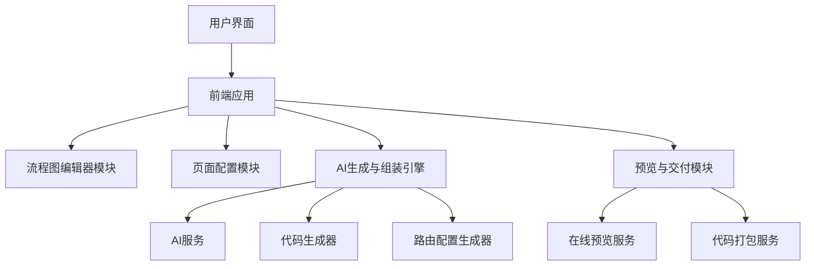
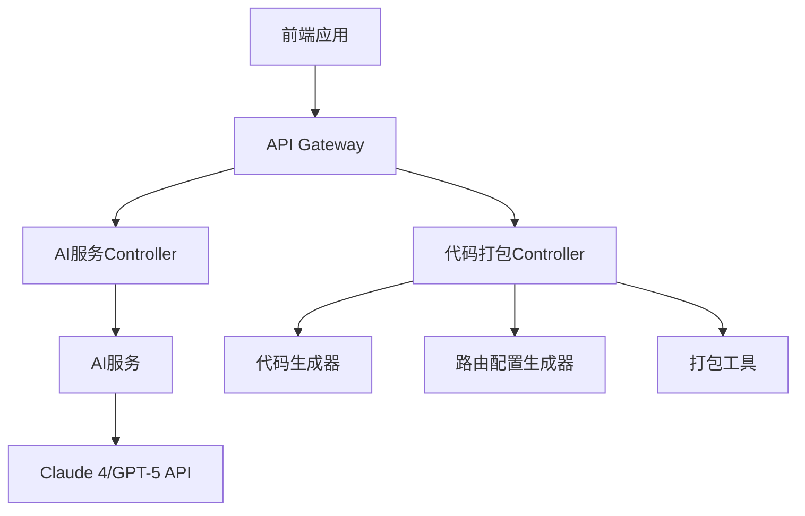
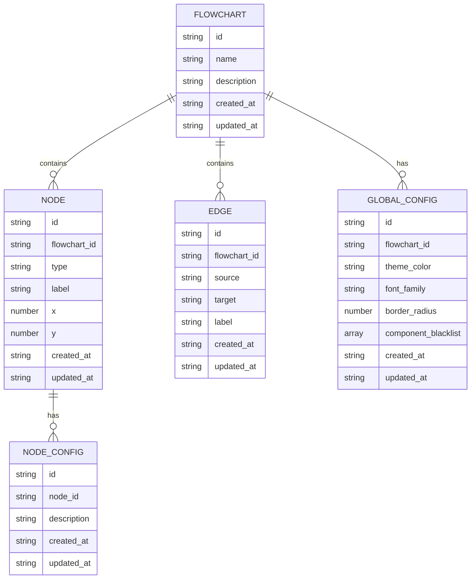

# 技术架构文档：FlowForge v1.0

---

## 1. 架构设计



## 2. 技术描述
- **前端**：React@18 + Tailwind CSS@3 + Vite
- **初始化工具**：Vite
- **流程图库**：React Flow
- **路由**：React Router
- **AI服务**：Claude 4或GPT-5 API
- **构建工具**：Vite
- **包管理器**：npm

## 3. 路由定义
| 路由 | 用途 |
|-------|---------|
| / | 主页/编辑器入口 |
| /editor | 流程图编辑器页面 |
| /config | 页面配置页面 |
| /generate | 生成与预览页面 |
| /preview | 在线预览页面 |

## 4. API定义

### 4.1 AI代码生成API
| 方法 | 路径 | 功能 | 请求体 | 响应 |
|------|------|------|--------|-------|
| POST | /api/generate | 生成页面代码 | `{pageDescription: string, globalStyles: object}` | `{code: string, error: string}` |
| POST | /api/generate-all | 批量生成所有页面代码 | `{pages: array, globalStyles: object}` | `{pages: array, error: string}` |

### 4.2 代码打包API
| 方法 | 路径 | 功能 | 请求体 | 响应 |
|------|------|------|--------|-------|
| POST | /api/package | 打包项目代码 | `{pages: array, routerConfig: object, globalStyles: object}` | `{downloadUrl: string, error: string}` |

## 5. 服务器架构图



## 6. 数据模型

### 6.1 数据模型定义



### 6.2 数据定义语言

#### 流程图表
```sql
CREATE TABLE flowcharts (
    id UUID PRIMARY KEY DEFAULT gen_random_uuid(),
    name VARCHAR(255) NOT NULL,
    description TEXT,
    created_at TIMESTAMP WITH TIME ZONE DEFAULT NOW(),
    updated_at TIMESTAMP WITH TIME ZONE DEFAULT NOW()
);
```

#### 节点表
```sql
CREATE TABLE nodes (
    id UUID PRIMARY KEY DEFAULT gen_random_uuid(),
    flowchart_id UUID REFERENCES flowcharts(id),
    type VARCHAR(50) NOT NULL,
    label VARCHAR(255) NOT NULL,
    x INTEGER NOT NULL,
    y INTEGER NOT NULL,
    created_at TIMESTAMP WITH TIME ZONE DEFAULT NOW(),
    updated_at TIMESTAMP WITH TIME ZONE DEFAULT NOW()
);
```

#### 连线路径表
```sql
CREATE TABLE edges (
    id UUID PRIMARY KEY DEFAULT gen_random_uuid(),
    flowchart_id UUID REFERENCES flowcharts(id),
    source VARCHAR(255) NOT NULL,
    target VARCHAR(255) NOT NULL,
    label VARCHAR(255),
    created_at TIMESTAMP WITH TIME ZONE DEFAULT NOW(),
    updated_at TIMESTAMP WITH TIME ZONE DEFAULT NOW()
);
```

#### 节点配置表
```sql
CREATE TABLE node_configs (
    id UUID PRIMARY KEY DEFAULT gen_random_uuid(),
    node_id UUID REFERENCES nodes(id),
    description TEXT NOT NULL,
    created_at TIMESTAMP WITH TIME ZONE DEFAULT NOW(),
    updated_at TIMESTAMP WITH TIME ZONE DEFAULT NOW()
);
```

#### 全局配置表
```sql
CREATE TABLE global_configs (
    id UUID PRIMARY KEY DEFAULT gen_random_uuid(),
    flowchart_id UUID REFERENCES flowcharts(id),
    theme_color VARCHAR(20) DEFAULT '#1E40AF',
    font_family VARCHAR(50) DEFAULT 'sans-serif',
    border_radius INTEGER DEFAULT 4,
    component_blacklist JSONB DEFAULT '[]',
    created_at TIMESTAMP WITH TIME ZONE DEFAULT NOW(),
    updated_at TIMESTAMP WITH TIME ZONE DEFAULT NOW()
);
```

---

## 7. 前端架构详细设计

### 7.1 组件结构
- **App**：根组件，处理路由和全局状态
- **Editor**：流程图编辑器主组件
  - **NodeLibrary**：节点库组件
  - **Canvas**：画布组件
  - **CanvasControls**：画布控制组件（缩放、平移等）
  - **ImportExport**：导入导出功能组件
- **Config**：页面配置组件
  - **NodeConfig**：节点配置子组件
  - **GlobalStyles**：全局样式配置子组件
  - **ComponentFilter**：组件过滤配置子组件
- **Generate**：生成与预览组件
  - **AIGenerator**：AI代码生成子组件
  - **Preview**：在线预览子组件
  - **CodeDownload**：代码下载子组件

### 7.2 状态管理
- 使用React Context API管理全局状态
- 流程图数据使用本地状态管理
- 生成状态使用本地状态管理

### 7.3 数据流
1. 用户在编辑器中创建流程图
2. 流程图数据存储在本地状态中
3. 用户配置页面提示词和全局样式
4. 用户点击生成按钮，触发AI代码生成
5. 生成的代码存储在本地状态中
6. 用户可以预览生成的应用或下载代码

## 8. 后端架构详细设计

### 8.1 API服务
- 使用Express.js构建RESTful API
- 处理AI代码生成请求
- 处理代码打包请求
- 处理预览服务请求

### 8.2 AI服务集成
- 集成Claude 4或GPT-5 API
- 实现并发生成策略
- 处理AI生成结果的解析和验证

### 8.3 代码生成器
- 解析流程图数据
- 生成React组件代码
- 生成React Router配置
- 生成Tailwind CSS样式

### 8.4 代码打包工具
- 使用Vite构建工具
- 打包生成的代码
- 生成可下载的压缩包

## 9. 性能优化策略

### 9.1 前端优化
- 使用React.memo和useCallback优化组件渲染
- 使用虚拟滚动处理大型流程图
- 延迟加载非关键组件
- 缓存生成的代码和预览结果

### 9.2 后端优化
- 使用并发请求处理多页面生成
- 实现代码生成结果缓存
- 使用流式响应处理大型代码生成
- 优化AI API调用参数

## 10. 安全性考虑

### 10.1 前端安全
- 输入验证和过滤
- 防止XSS攻击
- 安全的预览沙箱环境

### 10.2 后端安全
- API认证和授权
- 防止SQL注入
- 安全的AI API密钥管理
- 防止DoS攻击